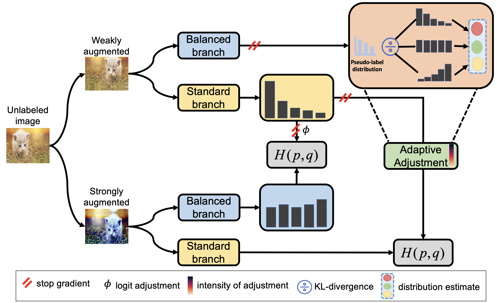

# [CVPR 2023] Towards Realistic Long-Tailed Semi-Supervised Learning: Consistency Is All You Need

This is PyTorch implementation of Towards Realistic Long-Tailed Semi-Supervised Learning: Consistency Is All You Need.




## Requirements

- Python 3.7.13
- PyTorch 1.12.0+cu116
- torchvision
- numpy


## Dataset

The directory structure for datasets looks like:
```
datasets
├── cifar-10
├── cifar-100
├── stl-10
├── imagenet32
└── imagenet64
```


## Usage

Train our proposed ACR on CIFAR10-LT of different settings.

For consistent:

```
python train.py --dataset cifar10 --num-max 500 --num-max-u 4000 --arch wideresnet --batch-size 64 --lr 0.03 --seed 0 --imb-ratio-label 100 --imb-ratio-unlabel 100 --ema-u 0.99 --out out/cifar-10/N500_M4000/consistent
```

For uniform:

```
python train.py --dataset cifar10 --num-max 500 --num-max-u 4000 --arch wideresnet --batch-size 64 --lr 0.03 --seed 0 --imb-ratio-label 100 --imb-ratio-unlabel 1 --ema-u 0.99 --out out/cifar-10/N500_M4000/uniform
```

For reversed:

```
python train.py --dataset cifar10 --num-max 500 --num-max-u 4000 --arch wideresnet --batch-size 64 --lr 0.03 --seed 0 --imb-ratio-label 100 --imb-ratio-unlabel 100 --ema-u 0.99 --flag-reverse-LT 1 --out out/cifar-10/N500_M4000/reversed
```

## Acknowledgement
Our code of ACR is based on the implementation of FixMatch. We thank the authors of the [FixMatch](https://github.com/kekmodel/FixMatch-pytorch) for making their code available to the public.


## Citation
```
@inproceedings{weitowards,
  title={Towards Realistic Long-Tailed Semi-Supervised Learning: Consistency Is All You Need},
  author={Wei, Tong and Gan, Kai},
  booktitle={Proceedings of the IEEE Conference on Computer Vision and Pattern Recognition},
  year={2023}
}
```


